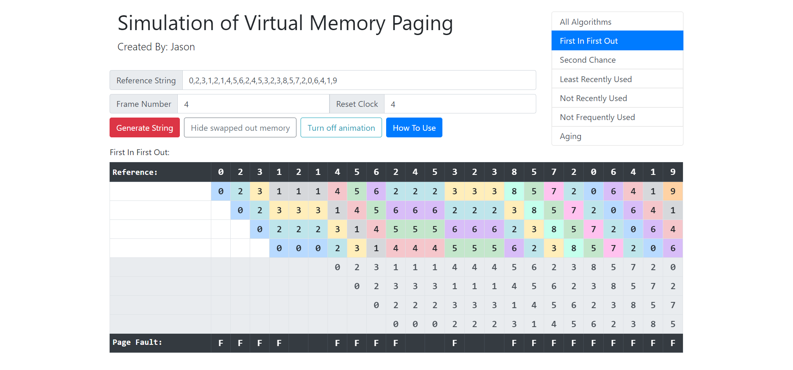

## Simulation of Virtual Memory Paging Algorithms

This is an operating system assignment conducted in my university which serves the purpose of visualizing virtual memory paging algorithms including First in First Out, Second Chance, Least Recently Used, Not Recently Used, Not Frequently Used and Aging.

## Development Platform

- Node.js (Package management and back end developmemnt)
- React JS (Front end development)

## Screenshot


## Development Guide

First, download and install node.js. 
Then, navigate to the source code folder and run:

```
npm install
npm start
```

Open [http://localhost:3000](http://localhost:3000) to view the application in the browser.


